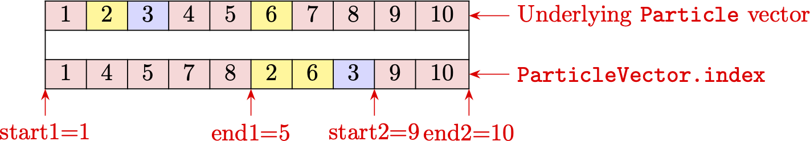

# Overview of basic building blocks

## Particle indexing: ParticleIndexer and ParticleIndexerArray
One of the main parts of the code is the `ParticleIndexer` struct.
It contains the starting and ending indices of the particles of a single species in a single cell.
During collisions, the number of the particles of a certain species in a cell may increase,
either due to inelastic processes, or due to particle splitting in variable-weight collisions.
These new particles are "tacked onto" the end of the whole array of particles of the species.
Thus, each  `ParticleIndexer` instance potentially tracks two blocks of particles that are all in a single cell:
the ones that were there before collisions were performed, and the new ones that got created during collisions
and are at the end of the array.


The figure above shows a graphical representation of the meaning of some of the fields
of the `ParticleIndexer` struct. Assume we have a set of 10 particles in 3 different cells (different cells
are colour-coded), with particles *1*, *2*, *3*, *7*, *8*, *9*, *10* located in cell **1**,
particles *4*, *5* located in cell **2**, and particle *6* located in cell **3**.
The `ParticleIndexer` struct corresponding to cell **1** will then have the following values for its fields:
```julia
particle_indexer_cell_1.start1 = 1
particle_indexer_cell_1.end1 = 3
particle_indexer_cell_1.start2 = 7
particle_indexer_cell_1.end2 = 10
```

The struct also has additional utility fields:
- `ParticleIndexer.n_group1 = ParticleIndexer.end1 - ParticleIndexer.start1 + 1` stores the number of particles in the first block
- `ParticleIndexer.n_group2 = ParticleIndexer.end2 - ParticleIndexer.start2 + 1` stores the number of particles in the second block
- `ParticleIndexer.n_local = ParticleIndexer.n_group1 + ParticleIndexer.n_group2` stores the total number of particles of this species in this cell.

The fields of the `ParticleIndexer` struct are not really intended for manual manipulation
unless one is developing new sorting or merging routines,
in which case one might have to set the starting and ending fields oneself.
Most of the time, the existing sorting/collision/merging routines take care of keeping the particle indexers updated and
correct.

Since we are usually interested in multi-species and/or multi-dimensional simulations, an array of `ParticleIndexer`
instances is needed to keep track of the particles of different species in different cells.
For this purpose Merzbild.jl provides the `ParticleIndexerArray` struct. It has two fields:
- `ParticleIndexerArray.indexer`: a 2-dimensional array of `ParticleIndexer` instances with dimensions `n_cells*n_species`
- `ParticleIndexerArray.n_total`: a 1-dimensional vector of length `n_species` with per-species total particle counts 

Thus, to iterate over the particles of a specific species in a specific cell, one uses an instance of the
`ParticleIndexerArray` (called `pia` in the code by convention):
```julia
for i in pia.indexer[cell,species].start1:pia.indexer[cell,species].end1
    # do something with particles[species][i]
end

if pia.indexer[cell,species].start2 > 0
    for i in pia.indexer[cell,species].start2:pia.indexer[cell,species].end2
        # do something with particles[species][i]
    end
end
```

Some utility functions are available for updating particle indexer arrays for developing new functionality:
[`Merzbild.update_particle_indexer_new_lower_count`](@ref) and [`Merzbild.update_particle_indexer_new_particle`](@ref).
It is assumed that if the number of particles in the second block pointed to by a `ParticleIndexer` instance is 0,
then the value of `start2` is set to a value smaller than 0, so to iterate over the particles in the second block one can either
do a check similar to the `pia.indexer[cell,species].start2 > 0` check seen above, or check
if `pia.indexer[cell,species].n_group2 <= 0`.

## Particles: Particle and ParticleVector
Now that we can index particles, we need to create some lists of particles to index. For that, we need
to define what a particle is.
For this purpose, a `Particle` struct is available in the code. It has the following fields:
- `w`: the computational weight of the particle (in a fixed-weight DSMC simulation, this is the ``F_{num}`` parameter)
- `v`: the 3-dimensional velocity vector of the particle
- `x`: the 3-dimensional position vector of the particle

Each species has its own list of particles associated with it, so a `particles` variable in the simulation could have the
following the type `Vector{Vector{Particle}}`. Then `particles[species_1]` would correspond to the list of all particles
of chemical species `species_1`. `pia.indexer[cell,species_1]` would then be used to index the particles of `species_1`
in a specific cell `cell`.

The drawback of using `Vector{Vector{Particle}}` is that for non-spatially homogeneous simulations, the particles need to be
sorted after each convection step, and this would involving constantly re-writing the position and velocity vectors.
To reduce the computational cost
of sorting, an additional abstraction layer is added via the struct `ParticleVector` that is intended to be used instead of 
a simple `Vector{Particle}` instance.
An instance of `ParticleVector` has the following fields:
- `particles`: the underlying vector of particles
- `index`: the sorted indices of the particles
- `cell`: used in particle sorting to keep track of new assigned cells
- `buffer`: a LIFO queue used to track which particles from `particles` are not being used (i.e. allocated in memory but not present in the simulation)
- `nbuffer`: the number of elements in `buffer`

Given a `ParticleVector` instance `pv`, one can still transparently access a particle at index `i` as `pv[i]`.
This access operation however uses the sorted `index` list to get the actual index of the particle,
so `pv[i]` is equivalent to `pv.particles[pv.index[i]]`. During particle sorting, only the indices in `index`
are shuffled around, which is computationally cheaper than sorting the particles directly.



The figure above shows the how the underlying particles (top array) are indexed via the help of the `index` field of the
`ParticleVector` struct, and finally how the indices of the particles in a specific cell are indexed by the
`ParticleIndexer` instance. In the example above, the different colors correspond to different grid cells.
It can be seen that the array of `Particle` instances ("underlying `Particle` vector") is unsorted.
The indices (`ParticleVector.index`) are however sorted.
Thus, `ParticleVector.index[1]` points to the 1-st particle in the underlying `Particle` array,
and `ParticleVector.index[2]` points to the 4-th particle.  `ParticleVector.index[6]` points to the 2-nd particle,
and so on. It may be that due to creation of new
particles during collisions some particles in the same cell are at the very end of the array (as they just got created).
In the example above, particles `9` and `10` are in the same cell as particles `1`, `4`, `5`, `7`, `8`.
Therefore the corresponding `ParticleIndexer` instance for this cell will have `start1=1`, `end1=5` (pointing
to the first block of indices), and `start2=9`, `end2=9` (pointing to the second block of indices).

For all practical purposes, it should be sufficient to deal with particles in a `ParticleVector` instance `pv`
by directly accessing them as `pv[i]`; the `index` and `cell` fields need to be changed only when one is writing
new sorting routines.

To summarize, for multi-species multi-dimensional simulations, one needs to use a `Vector{ParticleVector}` instance,
each element of which (of type `ParticleVector`) corresponds to a vector of particles of a specific species.
If one does not intend to sort particles (i.e. a 0-D simulation), one can in theory use a simple `Vector{Vector{Particle}}` instance,
however, some of the particle sampling routines assume a `ParticleVector` instance (as they write the cell index data).

## Physical data: Species
To sample particles, we need to know some properties of the chemical species that they represent.
This is done via instances of the `Species` struct, which have the following fields:
- `name`: the name of the species
- `mass`: the mass of the species
- `charge`: the charge of the species (in terms of elementary charge)
- `charge_div_mass`: the charge of the species (in Coulombs) divided by the mass of the species

Data about chemical species can be loaded by using the [`load_species_data`](@ref) function, which
reads a TOML file with the relevant species information.

## Sampling particles
In order to sample particles of a certain species from a specific distribution, Merzbild.jl provides
several functions. For fixed-weight DSMC simulations, one can use the [`sample_particles_equal_weight!`](@ref)
to sample equal-weight particles from either a Maxwell or a BKW distribution.
For variable-weight DSMC simulations, one can of course also use the same function (there is no inherent
difference between fixed- and variable-weight DSMC simulations in Merzbild).

However, in case variable-weight particles are allowed, one can also sample them from a distribution
by evaluating that distribution of a discrete velocity grid. This functionality is provided by the
[`sample_on_grid!`](@ref) function and its more specific version [`sample_maxwellian_on_grid!`](@ref)
that assumes a Maxwell distribution. Sampling on a grid can lead to very high particle counts
(for example, sampling on a 30x30x30 grid will lead to creation of up to 27000 particles in each physical cell),
so care must be taken, and particles might need to be merged immediately after having been created.

## Computing macroscopic physical properties: PhysProps
Now that we have a vector of particles, we can compute some macroscopic properties (density, velocity, etc.).
To store and use these properties where they might be needed, the `PhysProps` struct is provided.
An instance of `PhysProps` has the following fields:
- `ndens_not_Np`: a boolean value used to distinguish between the meanings of the `n` field (see below) and ensure consistency
- `n_cells`: number of grid cells
- `n_species`: number of species in the simulation
- `n_moments`: number of total moments computed (see below how moments are defined)
- `lpa`: vector of length `n_species` storing the lengths of the particle arrays (i.e. how many elements have been allocated, actual particle counts may be less)
- `np`: array with dimensions `n_cells*n_species`, stores the number of particles of each species in each grid cell
- `n`: array with dimensions `n_cells*n_species`, stores either the number of physical particles of each species in each grid cell or the number density of each species in each grid cell, see below for explanation
- `v`: array with dimensions `3*n_cells*n_species`, stores the x, y, and z components of the macroscopic velocity of each species in each grid cell 
- `T`: array with dimensions `n_cells*n_species`, stores the temperature of each species in each grid cell
- `moment_powers`: vector of length `n_moments`, stores which total moments are being computed
- `moments`: array with dimensions `n_moments*n_cells*n_species`, stores the total moments of each species in each grid cell
- `Tref`: a reference temperature set during initialization of a `PhysProps` instance used to scale the moments so that for an equilibrium distribution at a temperature of ``T_{ref}`` all moments are equal to 1.

One can see that the definition of the `n` field is somewhat ambiguous - it
can either mean the total number of particles in a cell, or the number density in a cell (equal to the number
of particles in the cell divided by the cell volume). To distinguish between these two cases, the following convention
is assumed: if a `PhysProps` instance is initialized with a constructor that has the physical grid amongst its arguments,
then `n` will mean the number density in a cell, and `ndens_not_NP` will be equal to `true`.
If a constructor is called without passing the physical grid, then `n` will mean the number of physical particles in a cell,
and `ndens_not_NP` will be equal to `false`.

The [`compute_props!`](@ref) function computes the macroscopical physical properties
of all species in all cells in the simulation.
Depending on whether the grid is passed as a parameter, it will compute either the number of particles in a cell
or the number density in a cell (as the cell volume is needed to compute the latter).
If there is an inconsistency between the value of the `ndens_not_NP` field of the `PhysProps`
instance passed to the [`compute_props!`](@ref) function and the meaning of the computed value
of `n` (i.e., the `PhysProps` instance has `ndens_not_NP` equal to `false`,
but a grid is passed to [`compute_props!`](@ref)), the code will raise an error.

If we don't need to compute the total moments, then we can create a `PhysProps` instance by simply
passing a `ParticleIndexerArray` instance to the constructor, as it already has the required information
on the number of grid cells and species. So we can simply do this: `props = PhysProps(pia)`.

The [`avg_props!`](@ref) function can also be used to time-average physical properties; this requires use of two
`PhysProps` instances, one of which holds the values of the physical properties at the current timestep,
and the other one holds the values of the averaged physical properties. Similarly to the previous case,
trying to average one `PhysProps` instance "into" another `PhysProps` instance with a different value
of the `ndens_not_NP` field will raise an error.

The total moment of order ``N`` is defined as
```math
M_{N} = \frac{1}{\sum_i w_i}\sum_i w_i \left(v_{x,i}^2+v_{y,i}^2+v_{z,i}^2\right)^{\frac{N}{2}}.
```
Here the summation is over all particles of a specific species in a particular grid cell.
Since computing the moments is expensive, a different function needs to be called to compute
all the physical properties **and** the moments: [`compute_props_with_total_moments!`](@ref).
If it is called and a `PhysProps` instance with `n_moments = 0` is passed to it, it will fall back
to the standard [`compute_props!`](@ref) to avoid unnecessary computations.

Support for computing mixed moments of the form 
```math
M_{abc} = \frac{1}{\sum_i w_i}\sum_i w_i v_{x,i}^a v_{y,i}^b v_{z,i}^c
```
is planned in future versions of Merzbild.jl.

## Writing output: NCDataHolder
Finally, once the properties have been computed, we need to output them.
Merzbild.jl uses the binary [NetCDF](https://www.unidata.ucar.edu/software/netcdf/) format
for its output, specifically the NetCDF4 version of the format.
The functionality is provided by the [NetCDF.jl](https://github.com/JuliaGeo/NetCDF.jl)
and [NCDatasets.jl](https://github.com/Alexander-Barth/NCDatasets.jl) libraries.
The testing code relies on NCDatasets.jl as originally Merzbild.jl used the library throughout the whole
code; however, the NetCDF.jl library was found to be significantly faster when used for output, so
all the non-testing code has been ported to NetCDF.jl. The NCDatasets.jl dependency will be dropped
in a future version once tests are ported to NetCDF.jl.

In order to write the physical properties to a NetCDF file, one needs to create an
`NCDataHolder` instance. It keeps track of the variables being output, the file handle, and the number of times
data has been written to a file. It also keeps track of whether the `ndens` output variable
actually corresponds to the number of particles in a cell or to the number density in a cell, based on the
flag in the `PhysProps` instance used to initialize the `NCDataHolder` instance.
(In a future version of Merzbild.jl, it is planned to change the output variable name based on the
`ndens_not_Np` flag value in the `PhysProps` instance used in the constructor.)

We can construct an `NCDataHolder` instance like this:
```julia
NCDataHolder("output_filename.nc", species_data, phys_props)
```

Additional global attributes can be written to the file if they are passed as a dictionary
using the `global_attributes` keyword of the constructor. Additionally, it is possible
to pass a list of variable names that should be skipped during output (i.e. they won't be written to
the NetCDF file), a more detailed description is given in the [public API reference](@ref "Merzbild.jl public API reference").

In order to write the physical properties to a file at a certain timestep, we need to call
```julia
write_netcdf_phys_props(ds, phys_props, timestep)
```
Here `ds` is the `NCDataHolder` instance, and timestep is the number of the timestep of the simulation
(it also gets written to the output). Additionally, the `sync_freq` keyword parameter can be set
to control how often the file is flushed (synchronized) to disk.

Finally, at the end of the simulation we need to close the file, so we call
```julia
close_netcdf(ds)
```

## Example: bringing it all together
An example of particle sampling, property computation, and output for a 0-D single-species gas is presented here.
```julia
using Merzbild
using Random

# set our random seed for reproducibility
seed = 1
Random.seed!(seed)
rng = Xoshiro(seed)

# load particle data
particles_data_path = joinpath("data", "particles.toml")
species_data = load_species_data(particles_data_path, "Ar")

# init particle vector for a 1000 particles
n_particles = 1000
particles = [ParticleVector(n_particles)]

# set number density to 1e23
ndens = 1e23

# and compute the particle weight Fnum
Fnum = ndens / n_particles

# set particle temperature
T = 500.0

# create the particle indexer array for 1 cell and 1 species, assume 0 particles since we haven't
# sampled any particles yet
pia = ParticleIndexerArray(0)

# sample particles in a [0.0, 1.0]x[0.0, 1.0]x[0.0, 1.0] cell
sample_particles_equal_weight!(rng, particles[1], pia, 1, 1, n_particles, T, species_data[1].mass, Fnum,
                               0.0, 1.0, 0.0, 1.0, 0.0, 1.0; distribution=:Maxwellian)

# create struct for computation of physical properties
phys_props = PhysProps(pia)

# create struct for netCDF output
ds = NCDataHolder("output.nc", species_data, phys_props)

# compute physical properties 
compute_props!(particles, pia, species_data, phys_props)

# and output them (t=0)
write_netcdf_phys_props(ds, phys_props, 0)
close_netcdf(ds)
```

## Summary

Now we have an overview of how to
1. Create a structure to hold particles
2. Index the vector of particles
4. Load species' data
3. Sample particles from a distribution
5. Compute macroscopic physical properties
6. Output these properties to disk

In the next section, an overview of how to simulate collisions will be given.